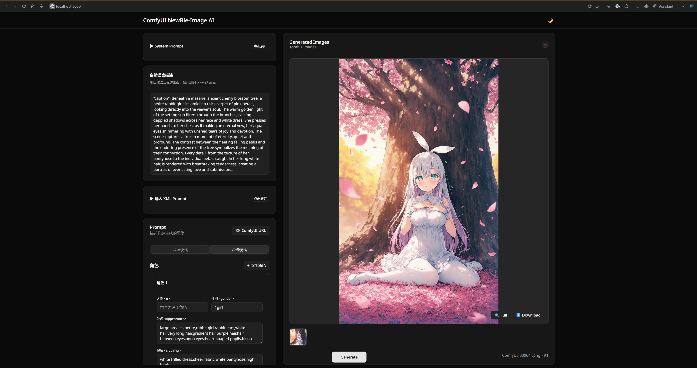

<h1 align="center">Newbie Image Generator</h1>

<p align="center">
  <a href="README.md">中文</a> | <a href="README_EN.md">English</a>
</p>

<p align="center">A modern ComfyUI Web frontend designed for <b>NewBie image Exp0.1</b> model</p>

<p align="center">
  
  
  
  
  
</p>

<p align="center">
  
</p>

## About NewBie image Exp0.1

[NewBie image Exp0.1](https://huggingface.co/NewBie-AI/NewBie-image-Exp0.1) is a 3.5B parameter text-to-image model based on Next-DiT architecture, focused on high-quality anime-style image generation.

- **Text Encoder**: Gemma3-4B-it + Jina CLIP v2
- **VAE**: FLUX.1-dev 16channel VAE
- **Features**: Supports XML structured prompts for more precise multi-character scene generation

## Features

- **Dual Mode Switching** - Simple mode for direct prompt input, structured mode for visual character attribute editing
- **Automatic XML Generation** - No need to write XML manually, focus on prompt content itself
- **XML Import** - Import existing XML prompts, automatically parse and populate corresponding text fields
- **Real-time Preview** - Display generation progress in real-time
- **One-click Model Download** - Built-in aria2c multi-threaded download with resume support
- **Clean & Beautiful** - Modern UI design, simple and intuitive
- **Theme Switching** - Dark/Light theme support
- **Responsive Layout** - Desktop and mobile support


### Differences and Advantages over Traditional SDXL

- **Prompt Structure**: Traditional SDXL uses natural language/tags; this project focuses on **XML structured prompts**, better suited for multi-character, layered descriptions and scene organization.
- **Model Adaptation**: NewBie image Exp0.1 is optimized for anime style, with built-in workflows and default parameters, avoiding trial-and-error with generic SDXL templates.
- **Controllability**: Structured tags explicitly separate character attributes/actions/positions, clearer information between characters, reducing cross-contamination.
- **Frontend Experience**: Provides visual forms, XML import, real-time preview and connection detection, lowering the barrier of traditional SDXL text-only prompts.
- **Multilingual Support**: Powered by Google Gemma3 model, supports prompts in Chinese, English, and Japanese.
- **Use Cases**: SDXL leans toward general-purpose realistic/stylized; NewBie + this frontend focuses more on **anime images and multi-character organization**.

## Prerequisites

- **ComfyUI**: Requires version 0.7.0 or higher (NewBie nodes built-in)
- **NewBie image Exp0.1 Model**: Complete model files required (see "Prepare Models" section below)

## Quick Start

### 1. Download Release Package

Download the latest release package from [Releases](../../releases) and extract to any directory.

### 2. Prepare Models

If you don't have the NewBie image Exp0.1 model yet, choose one of the following methods:

**Method 1: Use Download Script (Recommended)**

Run `download_models.bat` included in the package, supports multi-threaded download and resume.

**Method 2: Manual Download**

Download model files from HuggingFace:
| File | Download Link | Placement |
|------|---------------|-----------|
| gemma3-4b-it.safetensors | [Download](https://huggingface.co/NewBie-AI/NewBie-image-Exp0.1/resolve/main/text_encoder/gemma3-4b-it.safetensors) | `ComfyUI/models/clip/` |
| jina-clip-v2.safetensors | [Download](https://huggingface.co/NewBie-AI/NewBie-image-Exp0.1/resolve/main/clip_model/jina-clip-v2.safetensors) | `ComfyUI/models/clip/` |
| VAE (newbie-image.safetensors) | [Download](https://huggingface.co/NewBie-AI/NewBie-image-Exp0.1/resolve/main/vae/diffusion_pytorch_model.safetensors) | `ComfyUI/models/vae/` |
| UNet (transformer) | [Download](https://huggingface.co/NewBie-AI/NewBie-image-Exp0.1/resolve/main/transformer/diffusion_pytorch_model.safetensors) | `ComfyUI/models/unet/` |

> For users in China: Replace `huggingface.co` with `hf-mirror.com`

### 3. Launch Application

1. Ensure ComfyUI is running (default `127.0.0.1:8188`)
2. Double-click `start.bat`
3. Open browser and visit http://localhost:3000

## Developer Guide

```bash
# Clone repository
git clone https://github.com/your-username/newbie-image-generator.git
cd newbie-image-generator

# Backend
cd backend
cp .env.example .env
cargo run

# Frontend (Vite)
cd ../frontend
bun install
bun run dev
```

**Local Development Tips**
- Backend default: http://localhost:3000
- Frontend default: http://localhost:3001
- ComfyUI address can be modified in UI, backend and frontend will sync automatically

## Configuration

Edit `backend/.env`:

```env
HOST=0.0.0.0
PORT=3000
COMFYUI_HOST=127.0.0.1
COMFYUI_PORT=8188
```

## Tech Stack

| Layer | Technology |
|-------|------------|
| Frontend | React 19, Vite 7, shadcn/ui, Bun |
| Backend | Rust, Axum, Tokio, WebSocket |

## Related Links

- [ComfyUI](https://github.com/comfyanonymous/ComfyUI)
- [NewBie image Exp0.1 Model](https://huggingface.co/NewBie-AI/NewBie-image-Exp0.1)
- [ComfyUI-NewBie Nodes](https://github.com/E-Anlia/ComfyUI-NewBie)
- [LoRA Trainer](https://github.com/NewBieAI-Lab/NewbieLoraTrainer)
- [User Guide (Chinese)](https://ai.feishu.cn/wiki/P3sgwUUjWih8ZWkpr0WcwXSMnTb)

## License

MIT
